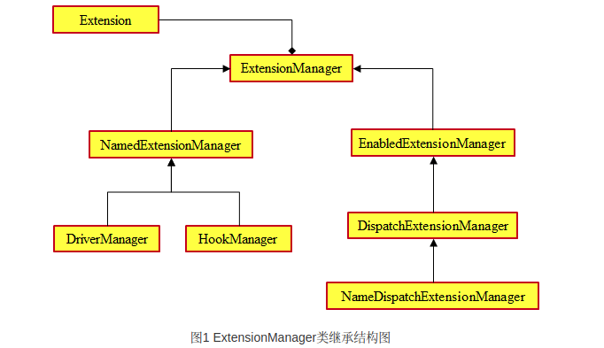
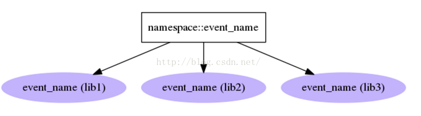
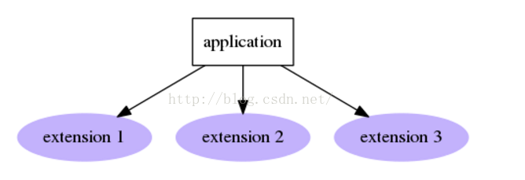

> stevedore是用来实现动态加载代码的开源模块。
>它是在OpenStack中用来加载插件的公共模块。
>可以独立于OpenStack而安装使用：
>https://pypi.python.org/pypi/stevedore/


> stevedore使用setuptools的entry points来定义并加载插件。
>entry point引用的是定义在模块中的对象，
>比如类、函数、实例等，只要在import模块时能够被创建的对象都可以。


### ExtensionManager基类
`ExtensionManager`类是一个所有其他manager类的基类:

>- namespace：string类型，命名空间，表示entry points的命名空间。
>- invoke_on_load：bool类型，表示是否自动加载扩展插件。
>- invoke_args：tuple类型，表示自动加载extension时传入的参数。
>- invoke_kwds：dict类型，表示自动加载extension时传入的参数。
>- propagate_map_exceptions：bool类型，表示使用map调用时，是否向上传递调用信息。
>- on_load_failure_callback：func类型，表示加载失败时调用的方法。
>- verify_requirements：bool类型，表示是否使用setuptools安装插件所需要的依赖。
>- map(func, *args, **kwds)：为每一个extension触发func()函数。
>- map_method(method_name, *args, **kwds)：为每一个extension触发method_name指定的函数。
>-names()：获取所有发现的extension名称。
>- entry_points_names()：返回所有entry_points的名称列表，每个列表元素是一个有entry points的名称和entry points列表的map对象。
>- list_entry_points()：某个命名空间的所有entry points列表。


其他所有`manager`类都需要继承`ExtensionManager`类，
而`ExtensionManager`类初始化时便会通过`namespace`等加载所有`extension`，
并对插件进行初始化。

````python
    def __init__(self, namespace,
                 invoke_on_load=False,
                 invoke_args=(),
                 invoke_kwds={},
                 propagate_map_exceptions=False,
                 on_load_failure_callback=None,
                 verify_requirements=False):
        self._init_attributes(
            namespace,
            propagate_map_exceptions=propagate_map_exceptions,
            on_load_failure_callback=on_load_failure_callback)
        extensions = self._load_plugins(invoke_on_load,
                                        invoke_args,
                                        invoke_kwds,
                                        verify_requirements)
        self._init_plugins(extensions)
````
在`ExtensionManager`实例化对象时，
首先调用`_init_attributes()`方法初始化`namespace`等参数，
然后会调用`_load_plugins()`方法加载所有的`extension`插件；
最后会调用`_init_plugins()`方法设置对象的属性。

`_load_plugions`会根据`list_entry_points`搜索到所有的`entry points`,


````python
    def _load_plugins(self, invoke_on_load, invoke_args, invoke_kwds,
                      verify_requirements):
        extensions = []
        for ep in self.list_entry_points():
            LOG.debug('found extension %r', ep)
            try:
                ext = self._load_one_plugin(ep,
                                            invoke_on_load,
                                            invoke_args,
                                            invoke_kwds,
                                            verify_requirements,
                                            )
                if ext:
                    extensions.append(ext)
````
`list_entry_points`又通过功能类`Cache`中的`get_group_all`来获得所有的`entry points`对象。
```python
    def list_entry_points(self):
        """Return the list of entry points for this namespace.

        The entry points are not actually loaded, their list is just read and
        returned.

        """
        if self.namespace not in self.ENTRY_POINT_CACHE:
            eps = list(_cache.get_group_all(self.namespace))
            self.ENTRY_POINT_CACHE[self.namespace] = eps
        return self.ENTRY_POINT_CACHE[self.namespace]
```

### 插件的名字 & 命名空间

- 命名空间被用来搜索entry points。
entry points的名字在给定的发布包中必须是唯一的，
但在一个命名空间中可以不唯一。

- 可独立注册，也就是说插件的开发和安装可以完全独立于使用它的应用，
只要开发者和使用者在命名空间和API上达成一致即可。

openstack(rocky)中`nova.scheduler`(`nova/set.cfg`)的命名空间:

````python
[entry_points]
    ...

nova.scheduler.driver =
    filter_scheduler = nova.scheduler.filter_scheduler:FilterScheduler
    caching_scheduler = nova.scheduler.caching_scheduler:CachingScheduler
    chance_scheduler = nova.scheduler.chance:ChanceScheduler
    fake_scheduler = nova.tests.unit.scheduler.fakes:FakeScheduler
    ...

````

### 加载插件的方式


- Drivers      
> `DriverManager`：在这种加载方式下，对于给定的命名空间，
一个名字只能对应一个`entry point`，
对于同一类资源有多个不同插件的情况，只能选择一个进行注册；
这样，在使用时就可以根据命名空间和名称定位到某一个插件，
其实现为`stevedore.driver.DriverManager`类。


- Hooks
>对于给定的命名空间，允许同一个命名空间下的插件拥有相同的名称，
程序可以根据给定的命名空间和名称加载该名称对应的多个插件，
其实现为`stevedore.hook.HookManager`类。



- Extensions

>多个名字，多个`entry point`。给定命名空间，
加载该命名空间中所有的插件，
当然也允许同一个命名空间中的插件具有相同的名字。




参考：

[OpenStack公共组件oslo之十六——stevedore](https://blog.csdn.net/Bill_Xiang_/article/details/78852717)

[Python深入：stevedore简介](https://blog.csdn.net/gqtcgq/article/details/49620279)
